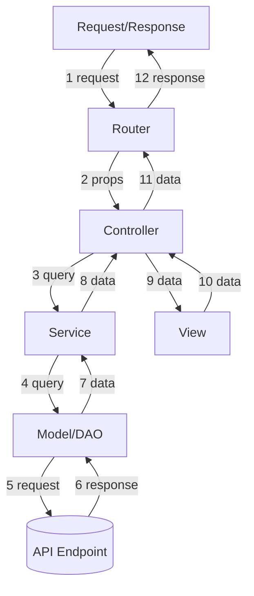

# Application Directory and File Structure

It is recommended you keep this README in your application-infrastructure directory as reference for you and others who are maintaining the application.

The original (and updated) document for this README may be found on the [API Gateway with Lambda utilizing 63klabs/cache-data Written in Node.js](https://github.com/63Klabs/atlantis-starter-02-apigw-lambda-cache-data-nodejs).

By default, the pipeline will look for the `application-infrastructure` directory at the root of your repository.

You can use this to your advantage by keeping documentation, specs, and TODO lists outside of your `application-infrastructure` deployment directory.

## Application Infrastructure

`/application-infrastructure`

Contains the build and deploy specifications for the application infrastructure.

This directory should be included in the root of your repository as the Pipeline expects this directory to contain the necessary files to build and deploy your application infrastructure. The basic README, LICENSE, and CHANGELOG as well as other non-build/deploy documents should be stored outside of this directory.

### Build Spec YAML file

`buildspec.yml`

Uses environment variables and scripts to build the project and assemble the artifacts. In addition to Bash commands, custom Python and Node scripts used during the build process may be stored in the build-scripts directory.

It should be written in a way to accommodate all deployment environments (dev, test, prod) so that there is only one buildspec. Use environment variables and template parameters to your advantage in constructing (and self-documenting) the differences in environments.

### Build Scripts directory

`build-scripts/`

Any custom Python, Node, or Bash scripts to assist in the build process. 

The Python script `generate-put-ssm.py` checks for the existence of required SSM parameters used by the application. If they don't exist, it creates them with either a default value set to `BLANK` or a generated app specific random string that can be used for hashing, encrypting, signing, or other crypto function. The SSM parameter script will read `template-configuration.json` for `Tags` to use in tagging the SSM Parameter resources.

The Python script `update_template_timestamp.py` is a workaround for a bug/unique feature that sometimes presents itself. It can be executed during the build phase to update two Lambda properties if there are issues deploying and having CloudFormation update the version and alias of the Lambda:

- `Properties.VersionDescription`
- `Properties.AutoPublishCodeSha256`

### Template YAML files

- `template.yml`
- `template-swagger.yml`
- `template-dashboard.yml`

The main CloudFormation template is template.yml but it can be broken down into smaller templates that are included during CloudFormation deployment. Templates for Swagger and Dashboards (and Step Functions) can get quite long it is advisable to store them in `template-swagger.yml` and `template-dashboard.yml` respectively and then perform an `Fn::Transform` and `AWS::Include` to bring it in.

#### Swagger Template

The Swagger template helps define and create the API Gateway resource by defining endpoints, query and header parameters, and response structure. After deployment, a Swagger document can be downloaded from API Gateway and imported into API development tools such as Postman. This helps in documenting the endpoint provided by your application.

If you are not using API Gateway as a trigger for your Lambda function, then the Swagger Template can be removed.

#### Dashboard Template

The Dashboard template defines the widgets that will be included in the CloudWatch dashboard so you can monitor your production environment. Typically dashboards are only created in PROD environments as they cost money and are not necessary for testing. The dashboard can contain monitoring graphs, tables, and logs for metrics such as error rates, cache rates, and traffic.

### template configuration JSON file

`template-configuration.yml`

The Template Configuration file can be thought of as a shim between the Parameter Overrides provided by Deploy (either CodeDeploy in a pipeline or `sam deploy` `samconfig.toml`) and the Parameter defaults in this application's template.yml file. It also holds the Tags to be applied to all the resources created by the application's infrastructure template.

While some parameter values may be specified in a deploy's overrides, you may wish to change the remaining defaults. You can either hard-code values or utilize variables available in the Build environment.

To utilize variables, make sure the variable is either available in the Build environment, or generated during the build process. The variable in `$VARIABLE$` format (Variable name with `$` at start and end) should be included as the value in the configuration file and have a corresponding search/replace in the buildspec file during the execution of the `sed` command.

### Public directory

`public/`

If you have static files to host in S3 you can place them in the public directory and then add the S3 sync command (`aws s3 sync`) to the list of commands in buildspec.yml. Note that that the S3 bucket must already exist outside of your application's CloudFormation template as CloudFormation will not have deployed the stack before buildspec runs.

## Src directory

`src/`

This directory stores the code for one or more Lambda functions and/or layers. The following documentation goes over a possible structure utilizing the Model, View, Controller (MVC) design pattern. MVC is used to organize code and provide a Separation of Concerns.

### Model-View-Controller Pattern



MVC allows for the separating of presentation (View) from business logic and data (Model/Controller). 

API vs. Traditional Web App: When building a RESTful API, the "View" is typically data serialized into formats like JSON, rather than an HTML page.

To supplement MVC, a Repository Pattern and Service Layer is included.

### Repository Pattern

- **Description:** The Repository Pattern is implemented using Data Access Objects which creates an abstraction layer between business logic and data access (like a database or another API call, retries, pagination, etc).
- **Benefits:** Decouples your business logic from the specific data source, making it easier to swap data sources or integrate with different backend services without affecting the core logic. Improves testability by allowing you to easily mock the data access layer.
- **Example:** A UserRepository might abstract how user data is retrieved, whether it's from a database or a separate user service API.

### Service Layer

- **Description:** A layer between the API (Controller) and the data access layer (Repository) that encapsulates business logic.
- **Benefits:** Centralizes complex business rules, keeps controllers thin and focused on request handling, and improves testability by isolating business logic.
- **Example:** An OrderService would contain the logic for creating an order, including calculations, stock checks, and payment processing.

### Index (Handler) JavaScript File

`src/index.js`

This is the entry point to your Lambda function and contains the function initialization (during Cold Starts) and any handlers.

The handlers should be kept simple, check to make sure initialization is complete, and then immediately hand off to the Router. Several handlers may be defined and then referenced by different endpoints in the Lambda API Event section in the CloudFormation template.

Note that using API Gateway and API Events in the template negate many of the features some frameworks such as Express provide. Authentication and response models can be handled by API Gateway, and introductory routing based on endpoint path can be defined in your Lambda CloudFormation template.

When an instance of a Lambda function is invoked for the first time there will be a Cold Start. All initialization that is required and shared by all subsequent invocations should be performed before the handler. This includes database connections, secrets gathering, and parsing of settings files.

The Config initialization is performed asynchronously, so there should be a Promise check (make sure promises are resolved) using an `await` before proceeding in the handler.

The handler should have a basic `try`/`catch`/`finally` block. The `try` block should pass the `context` and `event` to the Router.

### Config directory

`src/config/`

All (non secret) configuration files and methods safe for repositories and used across your application's deployments can be stored in the `config` directory. The Config object defined in this file is static and exists across invocations of the same instance. It should be initialized during a cold start.

### Utils directory

`src/utils/`

Shared methods that serve as tools, helpers, and utilities can be stored in the `utils` directory. These methods should be independent of Configurations, controllers, views, and models here. As your organization develops methods that are constantly re-used, they should probably be deployed as a Lambda Layer.

### Package JSON file

`src/package.json`

The `package.json` file contains information about the Node application including version number, dependencies, and script information such as for testing.

To install packages that your application uses on your local machine run `npm install` from within the `app` directory. To install or update specific packages for your application run `npm i package-name` (add the `--save-dev` flag if the package is only used locally for testing).

You are encouraged to update your version information using the `npm version` command before merging into the production pipeline.

- `npm version patch`
- `npm version minor`
- `npm version major`

### Routes directory

`src/routes/`

The `routes` directory receives the context and event information from the handler and then determines where to route the request. 

To do this, a `Request` object is created from the event and context. The `Request` object is a class that can be defined in Utils. Custom code can take information from the event and context and apply general business logic that can be used to inform the router of what route to send the request through. The business logic handled by the Request object should be very general and intended to be utilized by the Router and most downstream methods. Resource intensive tasks should be handled by the controller which can handle multiple tasks asynchronously.

Using a `switch` or `if-if-else-else` block, the Router sends the Request object to the proper view that will next process the request.

There should only be ONE route and subsequently, ONE view. Much like a web page can have multiple content pieces (some shared among other web pages) there is still only ONE web page. 

### Views directory

`src/views/`

A view assembles and formats the end result (response code, headers, and body) that will be returned as a response to API Gateway (and client). This may be the final HTML document, JSON, XML/RSS feed, or file to place in an S3 bucket. 

Views may call a controller directly, call in additional views, or a combination. 

> Views should not include business logic, they should only include document template information for the response. Break a large view into smaller content pieces as a view may contain other content pieces that are shared among other views.

Views may also include information beyond the body of the document such as response headers.

### Controllers directory

`src/controllers/`

Controllers contain the business logic that takes the request, analyzes its properties such as query string and path parameters, determines what services should be called, and after the services return data, sends the data to a view for final formatting.

Controllers should not worry about specific data models, the endpoint they access, or even caching. This allows them to be modular.

If a controller needs to dispatch queries to multiple services, they should be done async (in parallel).

```js
const tasks = [];
tasks.push(Service.userInfo.get(props));
tasks.push(Service.userOrders.get(props));
const [userInfo, orders] = await Promise.all(tasks);
```

If a controller requires data from one service before it can make a query of another service, it may do so sequentially.

```js
// TODO
```

### Services directory

`src/services/`

Caching is implemented at the service level.

Services should not worry about the endpoint they access, retries, pagination, etc. This allows them to be modular. If a database is changed out for a Restful API, or a database schema or authentication, changes, that should be captured in the Model or Data Access Object.

### Models and Data Access directory

`src/models/`

The `models` directory contain Data Access Objects (DAO) and fetch methods. "Data Access Objects" understand the connections (and authentication) that need to be made and any data transformations that need to take place before returning data back to the service.

Models should be developed using OOP (Object Oriented Programming) and well thought out so that they can be easily replaced. If a database connection and schema is swapped out for a Restful API endpoint, the downstream controller should not know the difference.

Models use Data Access Objects to perform the authentication, basic parameters, connections, retries, and pagination. Models can then transform the data returned into a usable format (parse XML, change an array to an keyed object, group a set of one dimensional database records into an object utilizing arrays, etc) for the service to return to the controller. (Similar to views, but for data).

Business logic, record by record transformation, and filtering should be reserved for the controller and view.

You may create a super class for a vendor to capture like attributes, and then multiple child classes (one for each specific endpoint) to extend the super class. You may even have a generic child class if the various endpoints don't change.

Why you might do this:

- Easier authentication across all endpoints by placing in super class. Less repetitive data in `Connection`.
- Easier to implement shared header or query string parameters (such as `format=json` if your endpoint requires such things)
- Easier to provide limits, pagination, and unique error code handling for the endpoints.

#### Static Data Directory

`src/models/static-data/`

The `models/static-data` directory contains supplemental static data that can be used for mapping and enhancing data returned by your application.

Any data that isn't dynamic can be stored and used as labels, mappings, enhancements, valid parameter lists, etc.

For example, suppose data from an outside system returns coded location information. For example, `US-CHI` for Chicago. You can store a JSON object with the code mappings so that your API web service can return a fully formatted, human readable location.

Another example is validating passed parameters. Suppose your application accepts a query string parameter for color coded data where there is a limited number of options and they stay relatively static. `['RED', 'BLUE', 'YELLOW', 'ORANGE', 'GREEN']` You store these as a separate file in static data and then import into your validation script to validate that the value passed from the client matches one of the accepted values.

#### Sample Data Directory

`src/models/sample-data`

The `models/sample-data` directory contains sample data that represents data is returned from Endpoints and Data Access Objects. They can be used during testing and early prototyping. 

For example, you could create a unit test that passes the data from a sample data file into a view and compares it to the expected output contained within a test-data file (See [Test Data](#test-data-directory)).

#### Test Data Directory

`src/models/test-data`

The `models/test-data` directory contains test data that represents data used for testing.

For example, you could create a unit test that passes the data from a sample data file into a view and compares it to the expected output contained within a test-data file. (See [Sample Data](#sample-data-directory)).

### Tests directory

`src/tests/`

The `tests` directory can be used to store your tests written using Mocha or other testing framework.

You can utilize sample and test data from the models directory for mocking and comparing results.

For example, you can read in a sample data file (written in JSON or JavaScript) and pass it to a method. You can then compare the output using a test data file. (See [Sample Data](#sample-data-directory) and [Test Data](#test-data-directory))
